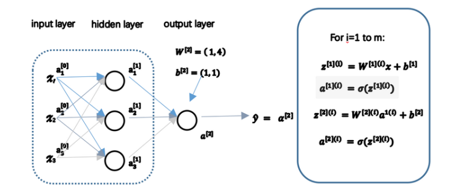
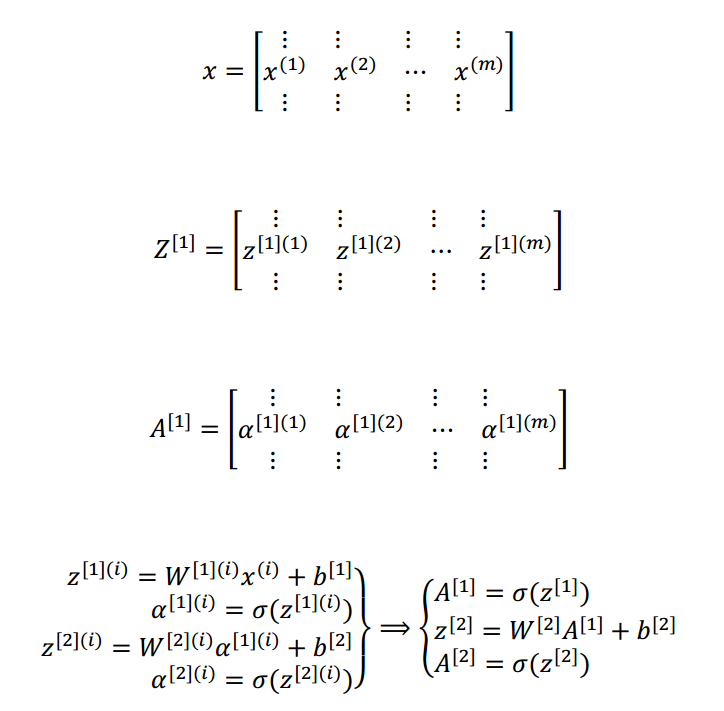
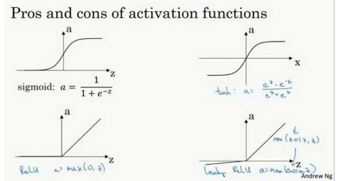

### 神经网络向量化表达式

样本通过列来表达，每一列代表一个样本

### 激活函数

$$
a=\frac{1}{1+e^{-z}}\\ a=tanh(z)=\frac{e^{z}-e^{-z}}{e^{z}+e^{-z}}
$$

* 结果表明**tanh**函数任何场合都优于**sigmoid**函数，因为值域在-1到1的激活函数，其均值更接近零均值。在训练一个算法模型是，如果使用tanh函数代替sigmoid函数中心化数据，使得数据的平均值更接近0而不是0.5

* 但有一个场合例外，在二分类问题中，对于输出层，因为y值是0或1，所以想让预测值y'介于0和1之间，所以需要用sigmoid函数。

* 一般隐藏层使用tanh激活函数，输出层使用sigmoid函数，所以在不同的神经网络层中，激活函数可以不同。

* sigmoid函数和tanh函数共同缺点是：在z特别大或者特别小是情况下，导数的梯度或者斜率会特别的小，最后会接近于0，导致降低梯度下降的速度。

* 修正线性单元的函数(ReLu),ReLu函数
  $$
  a=max(0,z)
  $$
  

只要z是正值的情况下，导数恒等于1，当z是负值的时候，导数恒等于0.

选择激活函数的经验法则：

如果输出0、1二分类问题，则输出层选择sigmoid函数，然后其它的所有单元选择Relu激活函数。这是很多激活函数的默认选择。有时，也会使用tanh激活函数，但Relu的一个优点是：当z是负值的时候，导数等于0.这里也有新的版本**Leaky Relu**，当z是负值时函数值会有轻微的倾斜。

两者的优点：

第一，在z的区间变动很大的情况下，激活函数的导数或者激活函数的斜率都会远大于0，学习速度快

第二，sigmoid和tanh的函数的导数载正负饱和区间的梯度接近0，这会造成梯度弥散

注意：Relu进入负半区的时候，梯度为0，神经元此时不会训练，产生所谓的稀疏性

### 激活函数的导数

$$
g(z)=\frac{1}{1+e^{-z}}\qquad      g'(z)=g(z)(1-g(z))
$$

$$
g(z)=tanh(z)=\frac{e^{z}-e^{-z}}{e^{z}+e^{-z}}\qquad g'(z)=1-(tanh(z))^{2}
$$

$$
g(z)=max(0,z)\qquad g(z)'=\begin{cases}
0 & if\quad z<0 \\
1 & if\quad z>0 \\
undefined & if\quad z=0
\end{cases}
$$

$$
g(z)=max(0.01z,z)\qquad g(z)'=\begin{cases}
0.01 & if\quad z<0 \\
1 & if\quad z>0 \\
undefined & if\quad z=0
\end{cases}
$$

### 神经网络梯度下降

* 训练参数需要做梯度下降，在训练神经网络的时候，随机初始化参数很重要，而不是初始化成全零。
